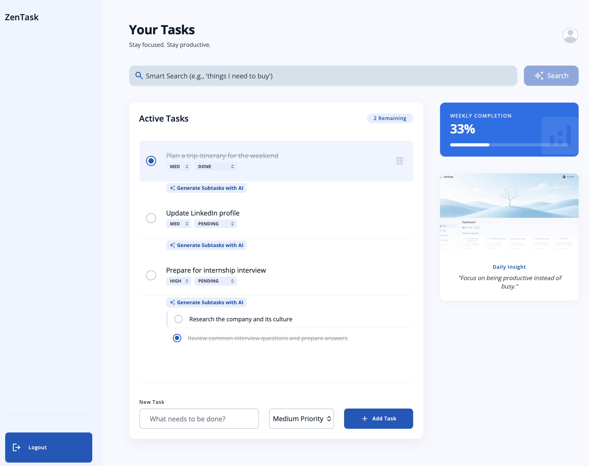

# ZenTask

A calm, minimal task manager built with React and Supabase, with AI-suggested subtasks and natural-language search.



## Features

- Email/password sign-up and login (Supabase Auth), with protected and public-only routes
- Create tasks with a priority (default `medium`); change priority or status (pending/done) inline; delete
- Subtasks per task, with their own done/delete controls
- "AI Subtasks" button on each task: calls a Supabase Edge Function (`generate-subtasks`, model `openai/gpt-4o-mini`) and shows suggestions
- Smart Search on the dashboard: calls a Supabase Edge Function (`smart-search`, embeddings from `openai/text-embedding-3-small`) and lists matching tasks
- Stats card showing completion percentage and a remaining-task count
- Profile page with avatar upload to Supabase Storage (`profile-pictures` bucket)
- Optimistic UI updates for status, priority and delete

## Tech stack

| Area | Choice |
|---|---|
| UI | React 19, React Router 7 |
| State | Zustand (`useAuthStore`, `useTaskStore`) |
| Styling | Tailwind CSS 3 (custom theme from the "Serene Productivity" design in `stitch_task_manager_dashboard_extracted/DESIGN.md`) |
| Backend | Supabase: Auth, Postgres (`tasks`, `subtasks`), Storage, Edge Functions |
| Tooling | Vite 8, Oxlint |

## How it works

```
React (Vite SPA, zentask-app/)
 ├─ pages/        Login, Signup, Dashboard, Profile
 ├─ components/   AddTask, TaskList, TaskItem, StatsCard, Sidebar, Header, DailyInsight
 ├─ store/        Zustand stores talk to Supabase
 └─ lib/supabase.js  single Supabase client (URL + anon key)
        │
        ▼
Supabase
 ├─ Auth      session in useAuthStore; routes gate on it
 ├─ Postgres  tasks / subtasks, queried by user_id
 ├─ Storage   profile-pictures bucket
 └─ Edge Functions  generate-subtasks, smart-search (invoked via supabase.functions.invoke)
```

- `useAuthStore` loads the session and subscribes to auth changes; `ProtectedRoute` redirects unauthenticated users to `/login`.
- `useTaskStore` fetches the signed-in user's tasks and subtasks and writes changes back. Status/priority/delete update local state first, then the database. Adding a task waits for the server response so it has the real ID.
- AI features run server-side in Edge Functions, so the AI provider key is not in the frontend.

## Run locally

Requires Node.js 20.19+ or 22.12+ (Vite 8's requirement) and a Supabase project.

```bash
cd zentask-app
npm install
cp .env.example .env   # then fill in your values
npm run dev
```

Other scripts: `npm run build`, `npm run preview`, `npm run lint`.

| Variable | Required | Purpose |
|---|---|---|
| `VITE_SUPABASE_URL` | Yes | Your Supabase project URL |
| `VITE_SUPABASE_ANON_KEY` | Yes | Supabase anon (public) key |

You must also set up the Supabase side yourself (setup SQL is not included in this repo, see the last section): the `tasks` and `subtasks` tables below, a `profile-pictures` storage bucket, and the `generate-subtasks` and `smart-search` Edge Functions. Without the functions, the AI Subtasks and Smart Search buttons will fail; the rest of the app does not depend on them.

### Database schema

Columns as reported by Supabase's `information_schema` (constraints and defaults not captured):

| Table | Column | Type | Nullable |
|---|---|---|---|
| `tasks` | `id` | uuid | no |
| `tasks` | `user_id` | uuid | no |
| `tasks` | `title` | text | no |
| `tasks` | `priority` | text | yes |
| `tasks` | `status` | text | yes |
| `tasks` | `created_at` | timestamptz | no |
| `tasks` | `embedding` | user-defined type | yes |
| `subtasks` | `id` | uuid | no |
| `subtasks` | `task_id` | uuid | no |
| `subtasks` | `user_id` | uuid | no |
| `subtasks` | `title` | text | no |
| `subtasks` | `status` | text | yes |
| `subtasks` | `created_at` | timestamptz | no |

Row Level Security is enabled on both tables. Supabase shows these policies: `subtasks` has one ALL policy ("Users can manage their own subtasks"); `tasks` has separate SELECT, INSERT, UPDATE and DELETE policies ("Users can ... their own tasks"). Per the author, the policies check `auth.uid() = user_id`, so each user can only access their own rows. The policy SQL is not in this repo.

Avatars go in the `profile-pictures` storage bucket, which is public (the app uses `getPublicUrl`). Files are saved as `<user-id>/<timestamp>.<ext>`. The bucket has two policies: "Auth Uploads" (INSERT, `bucket_id = 'profile-pictures' AND auth.role() = 'authenticated'`, so only logged-in users can upload, but it does not restrict them to their own folder) and "Public Read Access" (SELECT). There are no UPDATE or DELETE policies, so old avatars are not replaced or removed.

The frontend never reads `tasks.embedding`; it is used by the `smart-search` Edge Function (embedding model `openai/text-embedding-3-small`, per the author; the function source is not in this repo).

## Status and notes

- Work in progress; no tests in the repo.
- Not deployed. Runs locally only (see above).
- AI calls run in Supabase Edge Functions, so no AI provider key is in the frontend. Don't put one in a `VITE_` variable: it would be bundled into the browser.
- The "Daily Insight" card is a static quote and image, not generated.
- Dashboard failures for Smart Search currently show a browser `alert`.
- `stitch_task_manager_dashboard_extracted/` holds the original design export (`DESIGN.md`, `code.html`, `screen.png`) that the UI was based on.
- `zentask-app/README.md` is still the default Vite template text.

## Not included in this repo

- Edge Function source (`generate-subtasks`, `smart-search`); the model names above are as stated by the author
- Supabase setup SQL: exact RLS and storage policy definitions, and the `embedding` column's vector type and dimensions
